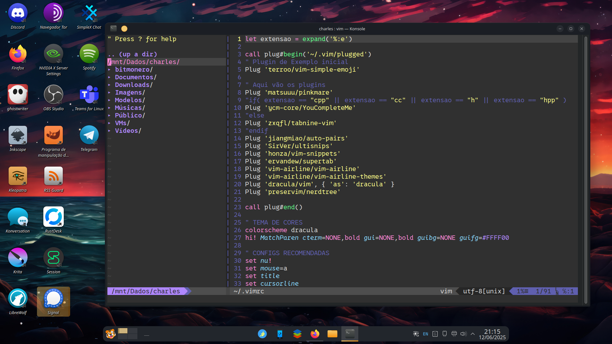

# 🧠 Meu Vim Config — .vimrc personalizado

Este é o meu setup pessoal de configuração do Vim, voltado para produtividade, completamento inteligente, navegação de arquivos e aparência elegante com o tema Dracula. A configuração é feita com o gerenciador de plugins vim-plug.

## 📦 Plugins Utilizados
| Plugin                                                                                                                                              | Função                                                             |
| --------------------------------------------------------------------------------------------------------------------------------------------------- | ------------------------------------------------------------------ |
| [`terroo/vim-simple-emoji`](https://github.com/terroo/vim-simple-emoji)                                                                             | Suporte básico a emojis no Vim                                     |
| [`matsuuu/pinkmare`](https://github.com/matsuuu/pinkmare)                                                                                           | Tema de cores opcional para alternar                               |
| [`ycm-core/YouCompleteMe`](https://github.com/ycm-core/YouCompleteMe)                                                                               | Auto-complete poderoso para C/C++                                  |
| [`zxqfl/tabnine-vim`](https://github.com/zxqfl/tabnine-vim)                                                                                         | Sugestões de código via IA (fallback caso não esteja usando C/C++) |
| [`jiangmiao/auto-pairs`](https://github.com/jiangmiao/auto-pairs)                                                                                   | Insere automaticamente pares de parênteses, colchetes, etc.        |
| [`SirVer/ultisnips`](https://github.com/SirVer/ultisnips) + [`honza/vim-snippets`](https://github.com/honza/vim-snippets)                           | Snippets inteligentes para várias linguagens                       |
| [`ervandew/supertab`](https://github.com/ervandew/supertab)                                                                                         | Uso da tecla TAB para navegar entre sugestões                      |
| [`vim-airline/vim-airline`](https://github.com/vim-airline/vim-airline) + [`vim-airline-themes`](https://github.com/vim-airline/vim-airline-themes) | Status bar customizada com ícones e tema                           |
| [`dracula/vim`](https://github.com/dracula/vim)                                                                                                     | Tema de cores Dracula                                              |
| [`preservim/nerdtree`](https://github.com/preservim/nerdtree)                                                                                       | Navegador de arquivos em árvore                                    |

## 🧾 Backup do .vimrc Antigo (Opcional, mas Recomendado)

Se você já possui um arquivo .vimrc personalizado, é altamente recomendado fazer um backup antes de substituí-lo. Assim, você poderá restaurar sua configuração anterior se desejar.

## 🔁 Como fazer backup:
Abra o terminal.
Execute o seguinte comando:

    mv ~/.vimrc ~/.vimrc.backup

Isso renomeia seu .vimrc atual para .vimrc.backup, mantendo-o seguro no mesmo diretório.

    
## 🔄 Como restaurar o backup depois (se quiser):

Se quiser desfazer a nova configuração e voltar para sua anterior:

    mv ~/.vimrc.backup ~/.vimrc

## 🛠️ Instalação

### Clone o repositório ou baixe apenas o arquivo .vimrc:

    git clone https://github.com/selrahcsan/vimrc.git
    cd vimrc
    cp vimrc ~/.vimrc

### Instale o gerenciador de plugins vim-plug:

    curl -fLo ~/.vim/autoload/plug.vim --create-dirs \
        https://raw.githubusercontent.com/junegunn/vim-plug/master/plug.vim

### Abra o Vim e instale os plugins:

    :PlugInstall

(Opcional) Para usar o YouCompleteMe, siga as instruções de [instalação do YCM.](https://github.com/ycm-core/YouCompleteMe#installation)

### [Fonte para criar o vimrc](https://terminalroot.com.br/2021/04/como-configurar-seu-vim-para-c-cpp.html)

